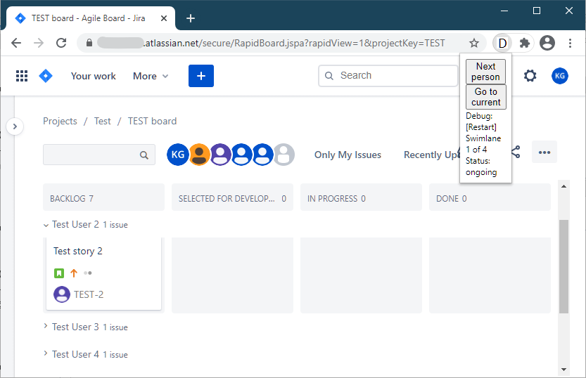

= Jira Daily Assistant Chrome plugin

Chrome plugin than can make your daily stand-ups more dynamic!

The extension uses Jira kanban board, where the swimlanes are configured for team memebers. It allows to randomly select
the order of daily stand-up participants and highlights the swimlane of the current person:

== Installation
* The plugin is not yet published to the Chrome Web Store, so head to the Releases page and download an archive with the
latest released version. Or simply clone the repository — skip the next step then.
* Extract the archive to some directory from which the extension will be loaded.
* Navigate to chrome://extensions/ and enable "Developer mode" (top-right corner).
* Click "Load unpacked" button (top-left corner) and select the directory with the extracted extension.
* Make sure the extension is pinned to the extension panel (click a "Puzzle piece" icon and select the extension from
the dropdown menu).

== Updates
Replace the extension files with the new version and click "Update" button (top-left corner).

== Usage
An extension appears as a "JDA" button. If a Kanban board is opened (RapidBoard.jspa), the extension can control it.

Click "Start daily" to navigate to the first participant. The button will turn into "Next person". Clicking it will
select the next person.

Click "Go to current" allows to quickly scroll to the current participant, as if they were selected by "Next person".

Debug section shows current daily status. "[Restart]" label is a button and starts the daily from the clean slate.

== Troubleshooting
If something doesn't work, try refreshing Jira page first.